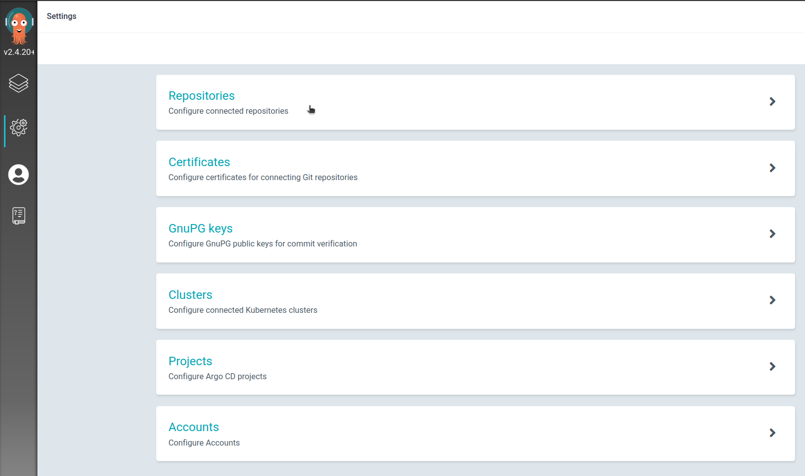

# Compliant Kubernetes Starter Kit for NodeJS (ArgoCD version)


## How do I deploy my application?

1. Click on [use this template](https://github.com/elastisys/ck8s-starter-argocd/generate) and create a new repository. This will be your **code repository**.
\
*It is recommended to be a private repository.*

2. Go to [this](https://github.com/elastisys/ck8s-starter-argocd-config) repository and create a new repository from that template, this will be your **config repository**.
\
*It is recommended to be a private repository.*

3. Navigate to harbor.$DOMAIN and login. Create a new project, and add a [robot account](https://goharbor.io/docs/2.2.0/working-with-projects/project-configuration/create-robot-accounts/) to that project.


4. Export these environment variables:
```
DOCKER_USER='robot$name'    # enter robot account name
DOCKER_PASSWORD=            # enter robot secret
DOMAIN=                     # enter your domain
```

5. Make sure your kubeconfig is in the namespace in which you want to deploy your demo application. Then run the script `init-setup-argocd.sh` in the scripts folder. This script will [setup a pull secret](https://elastisys.io/compliantkubernetes/user-guide/deploy/#configure-an-image-pull-secret) in your namespace, aswell as generate an SSH-key that will be used by both ArgoCD and the GitHub Actions workflow.
```
./scripts/init-setup-argocd.sh
```

6. Navigate to argocd.$DOMAIN and login. Go to "Manage your repositories, projects, settings", then click on Projects.

Click on "NEW PROJECT". Create your project and then edit the following:

**Source Repositories** \
your config-repository

**Destinations** \
Server: https://kubernetes.default.svc \
Name: * \
Namespace: your-namespace

7. Configure SSH-Keys. \
Copy your public key and add to **Deploy keys** under settings in your **config repository**. *Make sure you enable write access.* You can see your public key with this command:
```
cat ~/.ssh/argosshkey.pub
```
Navigate to argocd.$DOMAIN and login. Go to "Manage your repositories, projects, settings", then click on Repositories.

Read [here](https://argo-cd.readthedocs.io/en/stable/user-guide/private-repositories/#ssh-private-key-credential) on how to connect to private repository with argo using SSH-keys. \
You can see your private key with this command:
```
cat ~/.ssh/argosshkey
```

8. Under repositories in ArgoCD and click the three dots next to the one you just created, select "Create application".

- Name your application, select your project that you created, and select if you want a manual or automatic sync policy.
- Scroll down to "Source" and change "Path" to `ck8s-user-demo`.
- Scroll down to "Destination" and select "https://kubernetes.default.svc" as URL, and then enter your namespace.
- Click on "CREATE".

9. In the **code repository**, go to the environment `development`, and set the following [environment secrets](https://docs.github.com/en/actions/security-guides/encrypted-secrets#creating-encrypted-secrets-for-an-environment):

`DOCKER_PASSWORD` (1)
\
`SSH_PRIVKEY` (2)
\
`REPO_OWNER` (3)
\
`REPO_TARGET` (4)

(1) Robot account secret.

(2) The private SSH key created earlier.

(3) Name of the owner of config repository, either organization or username.

(4) Name of the config repository.

*Environments, environment secrets, and environment protection rules are available in public repositories for all products. For access to environments, environment secrets, and deployment branches in private or internal repositories, you must use GitHub Pro, GitHub Team, or GitHub Enterprise. **If your repositories is on an account without these permissions, you can create the secrets as normal repository secrets for the demo.** But please note that **all** branches will have access to the secrets, and using protected branches is not safe.*

10. In the **code repository**, make changes in the [workflow file](.github/workflows/build-and-deploy-to-ck8s.yaml):

`DOMAIN` (1)
\
`APP_DOMAIN` (2)
\
`DOCKER_USER` (3)
\
`REGISTRY_PROJECT` (4)

(1) Your $DOMAIN.

(2) Your desired_appname.$DOMAIN

(3) Name of robot account.

(4) Name of the harbor project you created.

11. Push your changes and done! \
Note that ArgoCD automatic sync interval is [by default 3 minutes](https://argo-cd.readthedocs.io/en/stable/user-guide/auto_sync/#automated-sync-semantics). So it may take some time before you see the changes.

## How do I use a protected branch and only deploy if someone reviewed?

1. Go to **Settings** -> **Environments**, chose `development` and edit. Under "Deployment branches", select "Protected branches". The secrets can now only be used on the protected branches.

2. Go to **Settings** -> **Branches**, click on "Add branch protection rule".

3. Enter the branch name "main", then click the checkbox for "Require a pull request before merging". Here you can also select extra checkboxes like "Require approvals", "Require review from Code Owners" and more.

4. Done! All changes must be done in separate branches and merged with a pull request to the main branch. After reviewing the changes and merging, it will trigger the workflow with the new changes and automatically deploy to ck8s.

## Why have two separate repositories for code and config?

You can read about ArgoCD best practices [here](https://argo-cd.readthedocs.io/en/stable/user-guide/best_practices/).

## How do I access my application?

Check the logs of GitHub Actions.

## Where do I find my application logs?

Check the logs of GitHub Actions.

## How do I set up alerts for my application?

Once you found you logs, check out [log-based alerts](https://elastisys.io/compliantkubernetes/user-guide/log-based-alerts/).

## I need help

Send the full output of your CI/CD pipeline to your TAM.